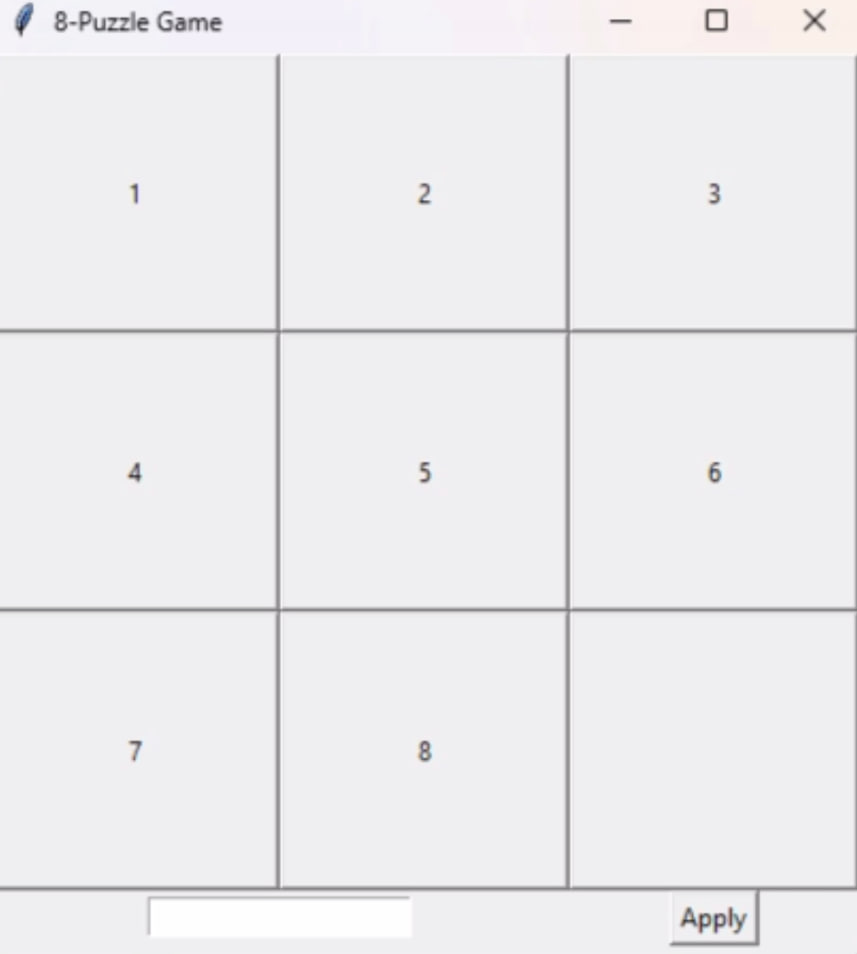

# 8puzzlegame
This project is a graphical implementation of the game 8-Puzzle on Python using Tkinter. Player can drag tiles to solve a puzzle, enter their initial state or generate random.

# 🧩 Project overwiev

A simple implementation of the classic **8-Puzzle** game in Python using **Tkinter**.  
The player can move tiles by clicking on them, shuffle the board randomly, or set a custom initial state.  

## ✨ Features
- 🔀 Random shuffling of tiles  
- 🎮 Move tiles by clicking (only valid moves allowed)  
- ⌨️ Input a custom starting state through the text field  
- 🖥️ Easy-to-use graphical interface with Tkinter  

## 🚀 How to Run
1. Install Python 3.  
2. Clone this repository or download the `8puzzlegame.py` file.  
3. Run the game:  
   ```bash
   python 8puzzlegame.py


